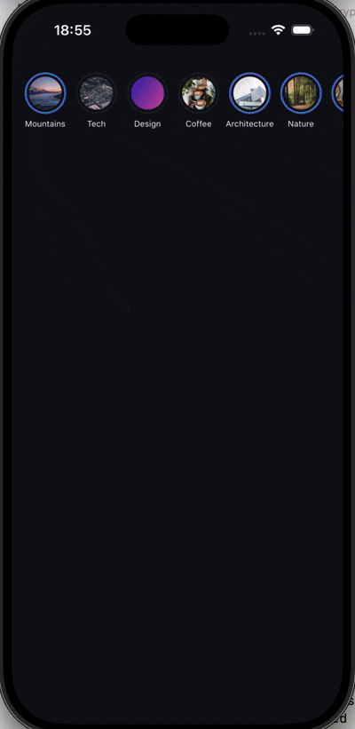
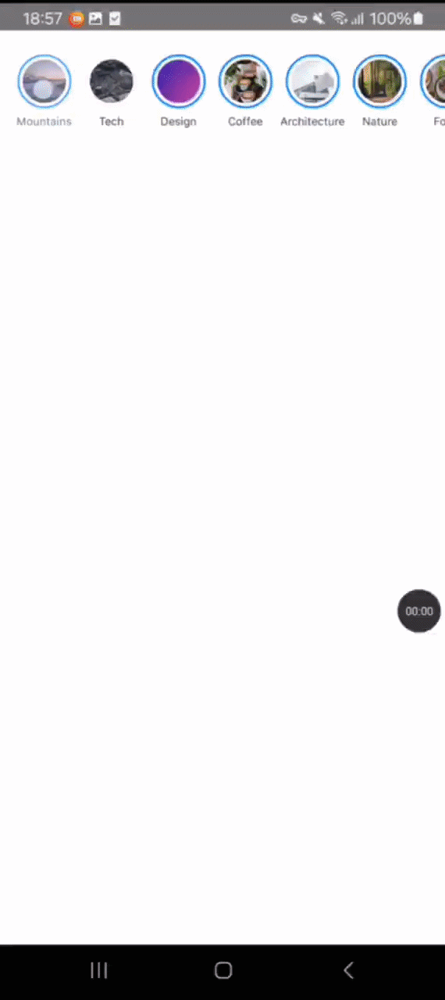
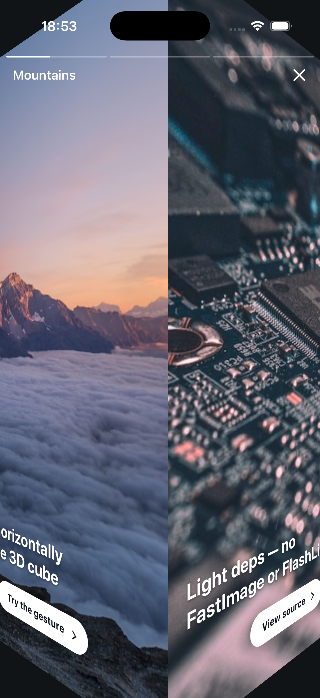
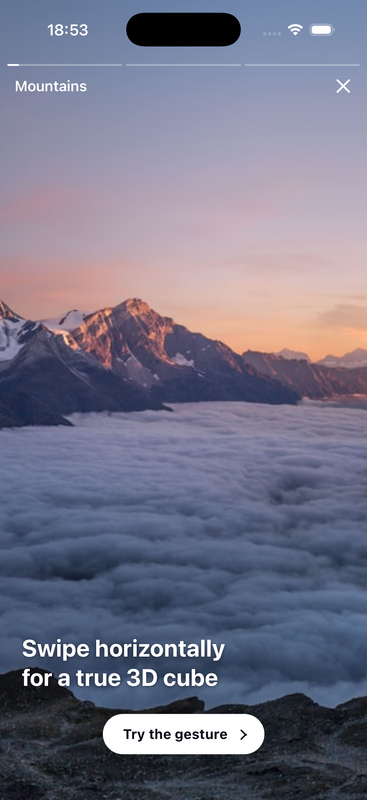
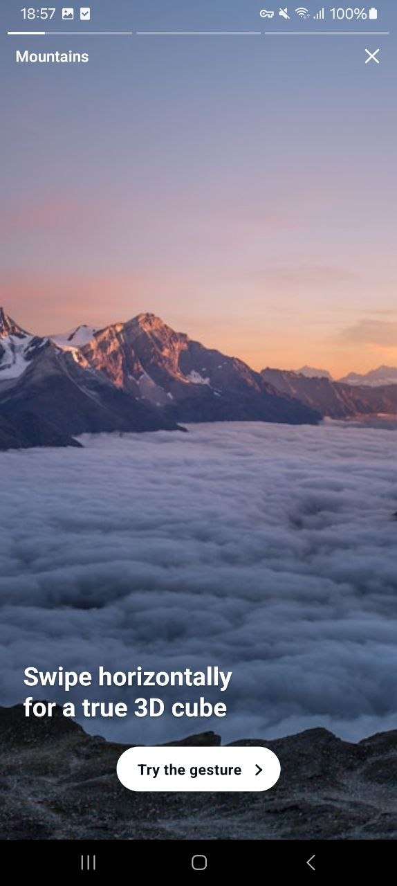
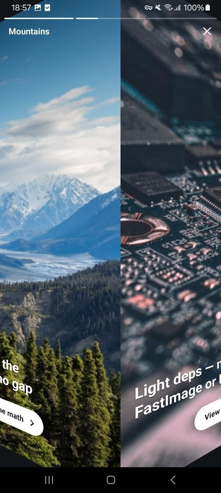

<h1 align="center">@novev9/react-native-instagram-stories</h1>

<p align="center">
  Modern Instagram-style stories for React Native with a <strong>true 3D cube swipe</strong>,<br/>
  headless render-prop slides, light dependencies, Fabric-ready internals,<br/>
  and optional pluggable storage. Built for RN 0.85+ / Reanimated 4.
</p>

<p align="center">
  <a href="https://www.npmjs.com/package/@novev9/react-native-instagram-stories"></a>
  <a href="https://github.com/novev9/react-native-instagram-stories/blob/main/LICENSE"></a>
  
  
  
</p>

<p align="center">
  
  &nbsp;
  
</p>

## Features

- 🧊 **Real 3D cube transition** between users (faces meet at the inner edge, not the "scale-0.49" carousel cube most libs ship)
- ⚙️ **New Architecture / Fabric ready** — runs on RN 0.85+, Reanimated 4, gesture-handler 2.x
- 🪶 **Light deps** — no FastImage, no FlashList, no Lodash, no Video. AsyncStorage is opt-in via a separate entry point
- 🪝 **Render-prop API** — bring your own slide content, avatar image, header, close button
- 👆 **Gestures** — pan to swipe, long-press to pause, swipe-down to dismiss, tap left/right to navigate slides
- 💾 **Pluggable persistence** — `StorageAdapter` interface, ships with in-memory + optional AsyncStorage adapter
- 📈 **Analytics callbacks** — `onShow`, `onViewSlide`, `onHide` (each payload carries `userId`, `slideId`, `slideIndex`)

## Screenshots

<table>
  <tr>
    <td align="center">
      <br/>
      <sub>iOS — story open</sub>
    </td>
    <td align="center">
      <br/>
      <sub>iOS — cube mid-swipe</sub>
    </td>
    <td align="center">
      <br/>
      <sub>Android — story open</sub>
    </td>
    <td align="center">
      <br/>
      <sub>Android — cube mid-swipe</sub>
    </td>
  </tr>
</table>

## Install

```sh
yarn add @novev9/react-native-instagram-stories \
  react-native-reanimated \
  react-native-gesture-handler \
  react-native-safe-area-context \
  react-native-svg
```

Optional for persistence:

```sh
yarn add @react-native-async-storage/async-storage
```

## Usage

```tsx
import React, { useRef } from 'react';
import { Image } from 'react-native';
import { Stories, type StoriesPublicMethods } from '@novev9/react-native-instagram-stories';

export function Feed({ stories }) {
  const ref = useRef<StoriesPublicMethods>(null);

  const users = stories.map(s => ({
    id: s.id,
    avatarSource: { uri: s.logo },
    name: s.name,
    stories: s.slides.map(slide => ({
      id: slide.id,
      source: { uri: slide.img },
      renderContent: () => (
        <Image source={{ uri: slide.img }} style={{ flex: 1 }} />
      ),
    })),
  }));

  return (
    <Stories
      ref={ref}
      users={users}
      showName
      onShow={e => console.log('open', e)}
      onViewSlide={e => console.log('slide', e)}
      onHide={e => console.log('close', e)}
    />
  );
}
```

### Persistence

By default the seen-progress map lives in memory (lost on unmount). For real persistence import the AsyncStorage adapter from the sub-entrypoint:

```tsx
import AsyncStorage from '@react-native-async-storage/async-storage';
import { createAsyncStorageAdapter } from '@novev9/react-native-instagram-stories/async-storage';

<Stories
  storage={createAsyncStorageAdapter(AsyncStorage)}
  // ...
/>
```

The main `@novev9/react-native-instagram-stories` import has zero dependency on AsyncStorage, so the lib stays light if you don't need persistence.

### Customising the avatar image (e.g. FastImage)

```tsx
import FastImage from 'react-native-fast-image';

<Stories
  renderAvatarImage={({ source, size }) => (
    <FastImage source={source} style={{ width: size, height: size }} />
  )}
  // ...
/>
```

### Customising the header / close button

```tsx
<Stories
  renderHeader={({ user, close }) => (
    <MyHeader title={user.name} onClose={close} />
  )}
  // or replace only the close button:
  renderCloseButton={({ close }) => <MyCloseIcon onPress={close} />}
  // ...
/>
```

## API

### `<Stories />` props

| Prop | Type | Default | Notes |
|---|---|---|---|
| `users` | `StoryUser[]` | — | Story users (avatar row + content) |
| `animationDuration` | `number` | `5000` | Default duration per slide in ms |
| `avatarBorderColors` | `string[]` | `['#FF5C5C']` | Avatar ring colours. ≥2 = linear gradient |
| `avatarSeenBorderColors` | `string[]` | `['rgba(128,128,128,0.5)']` | Ring colours when the user is fully seen |
| `avatarSize` | `number` | `50` | Avatar diameter |
| `showName` | `boolean` | `false` | Show name under avatar |
| `backgroundColor` | `string` | `'#000000'` | Modal background |
| `saveProgress` | `boolean` | `true` | Persist seen-progress |
| `storage` | `StorageAdapter` | in-memory | Custom storage backend |
| `renderHeader` | `(state) => ReactNode` | — | Override the in-modal header |
| `renderCloseButton` | `(state) => ReactNode` | — | Override only the close button |
| `renderAvatarImage` | `(state) => ReactNode` | RN `Image` | Override avatar image renderer |
| `onShow` | `(event) => void` | — | Fires on open |
| `onViewSlide` | `(event) => void` | — | Fires on every slide change |
| `onHide` | `(event) => void` | — | Fires on close, with last-viewed slide |

### Imperative methods (via `ref`)

| Method | Description |
|---|---|
| `show(userId, slideId?)` | Open the modal at a specific user (and optionally slide) |
| `hide()` | Close the modal |

Note: this library intentionally exposes a small imperative surface — `show` and `hide`. Slide navigation, pause/resume and end-of-stories close all happen automatically from gestures and the auto-progress timer. Open an issue if you have a use case that needs more.

## Why another stories lib

Modern React Native + a true 3D cube transition + minimal native dependencies. No FastImage, no FlashList, no Lodash, no Video — just the gesture / animation / safe-area / svg peers you almost certainly already have.

## License

MIT © Evgeny Novikov
